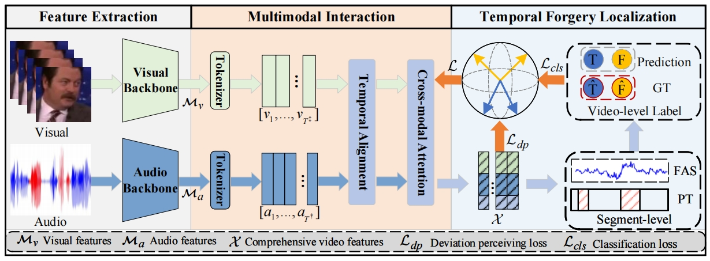

# A Multimodal Deviation Perceiving Framework for Weakly-Supervised Temporal Forgery Localization
This repo includes the authors' [Pytorch](https://pytorch.org/) implementation of the paper:
#### [A Multimodal Deviation Perceiving Framework for Weakly-Supervised Temporal Forgery Localization](https://arxiv.org/abs/2507.16596)
ACM International Conference on Multimedia (ACM MM) 2025
[[arxiv](https://arxiv.org/abs/2507.16596)]
In this paper, we explore the weakly-supervised temporal forgery localization for the task of Deepfake detection.

- We propose a multimodal deviation perceiving framework for weakly-supervised temporal forgery localization, which could identify the timestamps of temporal forged segments using only video-level annotations.
- A temporal property preserving cross-modal attention is proposed, which is to perceive the inter-modality deviation between the visual and audio features and construct representative comprehensive video features.
- An extensible deviation perceiving loss is proposed for weakly-supervised learning, which aims at enlarging the temporal deviation of forged samples while reducing that of genuine samples.

  


## Training
To train our model from scratch, please run :
```
python3 train.py
```